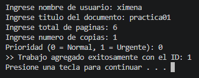
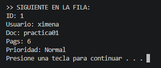
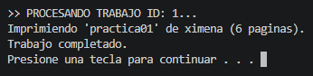

# Reporte de Práctica 01: Cola de impresión en lenguaje C

**Materia:** 40032 - Paradigmas de la Programación [cite: 11]  
**Docente:** M.I. José Carlos Gallegos Mariscal  
**Grupo:** 941 

---

## 1. Introducción
En esta práctica se desarrolló un simulador de cola de impresión en lenguaje C para gestionar trabajos de impresión (`print jobs`) bajo una estructura **FIFO** (First In, First Out). El objetivo principal fue contrastar el manejo de memoria estática frente a la dinámica y entender los conceptos de alcance y duración de variables en un entorno controlado.

## 2. Diseño del Sistema

### 2.1. Estructura de Datos (PrintJob_t)
Se utilizó una estructura centralizada para definir cada trabajo, incluyendo campos para la simulación de progreso:

* **ID:** Identificador autoincremental único.
* **Usuario y Documento:** Cadenas de caracteres con tamaños máximos definidos (`MAX_USER`, `MAX_DOC`).
* **Páginas:** Se gestionan `paginas_total` y `paginas_restantes` para simular el avance.
* **Estado:** Enumeración (`Estado_t`) que incluye `EN_COLA`, `IMPRIMIENDO`, `COMPLETADO` y `CANCELADO`.

### 2.2. Arquitectura de las Colas
1. **Versión Estática (Sesión 1):** Utiliza un arreglo fijo `data[MAX_JOBS]` con una capacidad de 10 elementos. El frente siempre se ubica en el índice 0, lo que requiere un desplazamiento (*shift*) de elementos en cada extracción.
2. **Versión Dinámica (Sesión 2):** Implementada mediante una lista enlazada con punteros `head` y `tail`. Esto permite una gestión eficiente de la memoria en el *heap*.

## 3. Demostración de Conceptos

### 3.1. Alcance y Duración de Variables
* **Local:** Variables definidas dentro de funciones (ej. `temp_job` en `main`), cuyo ciclo de vida se limita a la ejecución del bloque.
* **Static:** Se utilizó una variable `static` para el contador de IDs, permitiendo que el valor persista entre llamadas a la función de inserción.
* **Dinámica:** Los nodos creados con `malloc` residen en el *heap* hasta que se liberan explícitamente con `free`.

### 3.2. Contratos y Subprogramas
Se aplicaron contratos claros mediante el uso de punteros y calificadores de tipo:
* **Paso por Referencia:** Funciones que modifican la cola reciben un puntero (ej. `QueueDynamic_t* q`).
* **Uso de const:** Las funciones de consulta (ej. `qs_is_empty`) utilizan `const` para garantizar que no habrá efectos secundarios en los datos.

## 4. Análisis Comparativo

| Característica | Memoria Estática | Memoria Dinámica |
| :--- | :--- | :--- |
| **Capacidad** | Límite rígido (10 trabajos). | Flexible (limitada por RAM). |
| **Complejidad Dequeue** | $O(n)$ por el desplazamiento (*shift*). | $O(1)$ reasignando punteros. |
| **Riesgos** | Desbordamiento (Cola llena). | Fugas de memoria (Memory leaks). |

## 5. Simulación (Sesión 3)
Se implementó un algoritmo de simulación que recorre la cola realizando las siguientes acciones[cite: 255, 257]:
1. Cambia el estado del trabajo a `IMPRIMIENDO`[cite: 259].
2. Reduce `paginas_restantes` de forma iterativa.
3. Introduce un retardo (`delay`) por cada página procesada basándose en `ms_por_pagina`.
4. Al finalizar, marca el trabajo como `COMPLETADO`.

## 6. Respuestas a Preguntas Guía
* **¿Por qué peek no debe modificar la cola?** Porque su función es únicamente la inspección del frente para la toma de decisiones, sin alterar el orden FIFO.
* **Invariantes:** Se garantiza que `size` siempre represente la cantidad real de elementos y que en la versión estática el frente siempre sea `data[0]`.
* **Liberación de Memoria:** La función `qd_destroy` es la responsable de recorrer la lista y liberar cada nodo para asegurar una salida limpia del programa.

---

## Evidencia de Ejecución

*Figura 1: Demostración de validación de cola llena en memoria estática.*

*Figura 2: Procesamiento de trabajos mediante lista enlazada.*

*Figura 3: Simulación de impresión con estados y avance de páginas.*

---

## Conclusiones
La práctica permitió comprender la importancia de elegir la estructura de datos adecuada según las necesidades de memoria y rendimiento. Se concluye que el manejo dinámico es superior para sistemas de impresión escalables, aunque requiere un control riguroso del ciclo de vida de los punteros para evitar errores en tiempo de ejecución.

## Enlaces 
[Repositorio de GitHub](https://github.com/menaxmn/Portafolio_PP.git "Repositorio GitHub")

[Sitio Estatico](http://localhost:1313/practica1/)