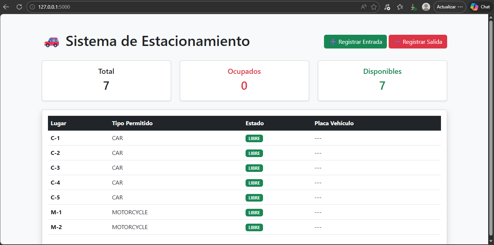
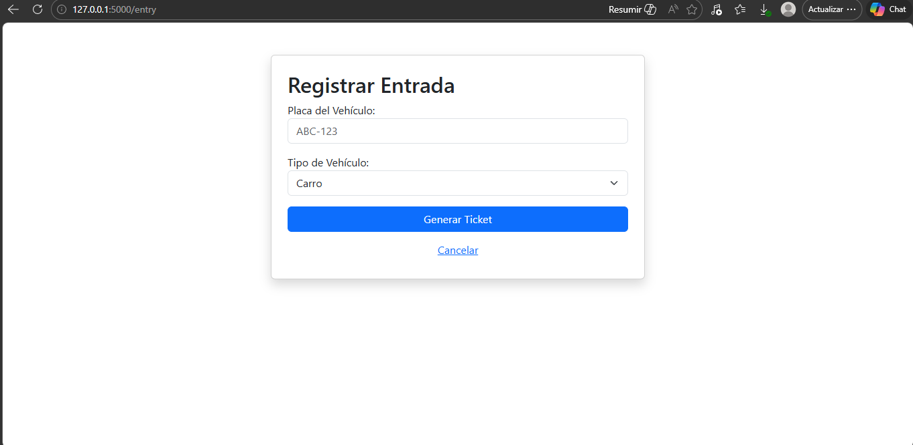
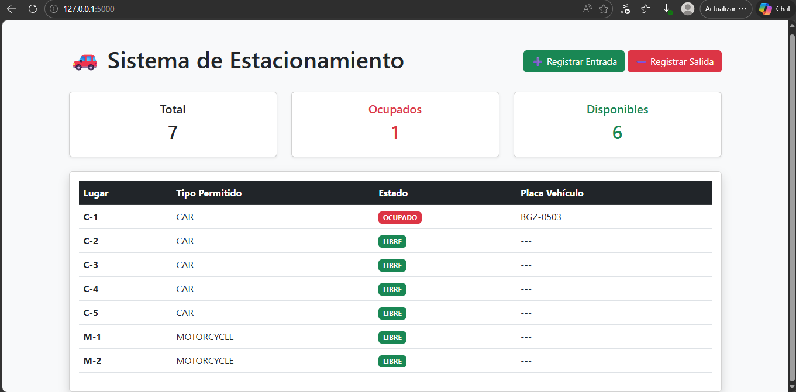

+++
date = '2026-05-01T16:55:27-07:00'
draft = false
title = 'Practica2: El paradigma orientado a objetos'
+++

# Introducción

En esta segunda práctica, el objetivo fue diseñar e implementar un **Simulador de Estacionamiento (Parking Lot)** aplicando de manera integral los pilares de la **Programación Orientada a Objetos (POO)**. 

A diferencia de un script lineal, este proyecto utiliza una estructura modular y profesional que permite gestionar diferentes tipos de vehículos (carros y motos), asignar cajones de estacionamiento según compatibilidad y aplicar reglas de negocio dinámicas, como el cálculo de tarifas mediante estrategias polimórficas. Para la visualización final, se integró el framework **Flask**, permitiendo una separación clara entre la lógica de negocio y la interfaz de usuario bajo un patrón **MVC (Modelo-Vista-Controlador)**.

---

# Arquitectura y Diseño

El sistema se diseñó pensando en la escalabilidad. La lógica del estacionamiento reside en el **Modelo**, lo que la hace totalmente independiente de si se ejecuta en una consola (CLI) o en una aplicación web.

### Estructura de Clases y Responsabilidades:
* **`Vehicle` (Abstracción):** Clase base que define las propiedades esenciales (placa y tipo). La abstracción es el proceso mental y lógico mediante el cual se aislan las características esenciales de un objeto, eliminando los detalles complejos o irrelevantes para el conexto actual.
* **`Car` & `Motorcycle` (Subtipos):** Implementan la herencia para permitir comportamientos o tarifas específicas por tipo de vehículo, esto significa que, aunque todos los vehiculos comparten una base común (el supertipo), cada subtipo puede "especializarse". Al heredar, no solo reciben las propiedades generales, sino que ganan libertad de definir sus propias reglas de negocio.
* **`ParkingLot`:** El controlador del dominio que administra la colección de cajones, gestiona los tickets activos y coordina las entradas y salidas actuando como el punto de entrada único para la lógica de negocio. Su responsabilidad principal es garantizar la integridad del sistema, asegurando que no se asignen mas vehículos de los que la capacidad física permite y centralizando el flujo.
* **`ParkingSpot`:** Representa el espacio físico. Es responsable de conocer su estado (libre/ocupado) y validar si es compatible con el vehículo que intenta ingresar. Para lograrlo, interactua directamente con los datos del vehiculo y actualiza su disponibilidad en tiempo real mediante métodos como occupy() y vacate(), asergurandp que el sistema central refleje la ocupacion exacta de cada nivel o zona del estacionamiento.
* **`Ticket`:** Documento digital que vincula al vehículo con su lugar y registra las marcas de tiempo para el cobro final.  Actúa como el registro histórico de la sesión de estacinamiento, almacenando la hora de ingreso, la hora de salida y el estado de pago, lo que permite al sistema calucular la tarifa exacta al momento de salida.
* **`RatePolicy` (Interfaz):** Define el contrato para el cálculo de costos, permitiendo intercambiar algoritmos de cobro sin modificar el resto del sistema. A través de un método estándar como calcularFee(ticket), las diferentes implementaciones (como tarifas por hora, tarifas fijas de fin de semana o descuentos para clientes frecuentes) pueden aplicarse deinámicamente segun las reglas del negocio vigentes.


---

#  Evidencia de Implementación POO

Para cumplir con los criterios de evaluación, el sistema integra los siguientes conceptos avanzados:

### 1. Encapsulamiento y Validación de Invariantes
El modelo protege su integridad mediante atributos privados y métodos que validan "invariantes" (reglas que siempre deben ser ciertas):
* **Validación de Ocupación:** Un cajón no puede marcarse como ocupado si ya tiene un vehículo asignado.
* **Integridad de Salida:** No se puede procesar la salida de un ticket que no existe o que ya ha sido cerrado.

### 2. Abstracción y Polimorfismo
Se utilizó el polimorfismo para manejar las tarifas. El `ParkingLot` no sabe "cómo" se calcula el dinero; simplemente le pide a la política inyectada (`RatePolicy`) que realice el cálculo basado en el tiempo y el tipo de vehículo.

### 3. Composición
El sistema utiliza una relación de "tiene-un". Un `ParkingLot` **está compuesto** por una lista de objetos `ParkingSpot`, delegando en ellos la responsabilidad de su propio estado.

---

# 🌐 Interfaz Web (Flask MVC)

La aplicación web se divide siguiendo el diagrama de componentes del sistema:

* **Model:** Clases de dominio en `models/` (Python puro).
* **View:** Plantillas HTML con Jinja2 en `templates/`.
* **Controller:** Rutas en `app.py` que gestionan el flujo de datos.

### Flujos de Trabajo Demostrados:
1.  **Dashboard de Ocupación:** Muestra en tiempo real cuántos lugares hay libres y quiénes ocupan los activos.

2.  **Registro de Entrada:** Formulario que captura placas y tipo, instanciando el objeto correcto y asignando un lugar compatible.

3.  **Proceso de Salida:** Calcula el tiempo transcurrido, aplica la tarifa polimórfica y libera el espacio automáticamente.


---

[GitHub](https://github.com/menaxmn/Portafolio_PP.git "Repositorio GitHub")

#  Fragmentos de Código Clave

### Polimorfismo en la Política de Cobro
Este fragmento demuestra cómo la **Abstracción** permite cambiar la lógica de cobro sin afectar a la clase `Ticket`.

```python
class HourlyRatePolicy(RatePolicy):
    """Calcula el costo basado en horas transcurridas."""
    def calculate(self, hours: float, v: Vehicle) -> float:
        rate = 20.0 if v.type == VehicleType.CAR else 10.0
        return hours * rate

class FlatRatePolicy(RatePolicy):
    """Tarifa única independientemente del tiempo."""
    def calculate(self, hours: float, v: Vehicle) -> float:
        return 50.0
