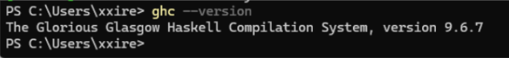
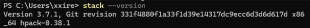
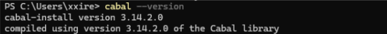
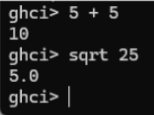

+++
date = '2026-05-01T16:55:32-07:00'
draft = false
title = 'Practica3: El paradigma funcional'
+++


# Introducción

En esta práctica se realizó la instalación y configuración del entorno de desarrollo del lenguaje de programación funcional **Haskell** utilizando la herramienta oficial GHCup. Además, se verificó el funcionamiento del compilador, del intérprete interactivo y de las herramientas principales del ecosistema de Haskell. Finalmente, se ejecutó una aplicación tipo TODO para comprender el flujo de trabajo y la estructura básica de un proyecto desarrollado en Haskell.

---

# Objetivo

El objetivo de esta práctica fue instalar correctamente el entorno de desarrollo de Haskell, verificar su funcionamiento y ejecutar una aplicación de ejemplo para conocer el uso de herramientas como GHC, Stack y Cabal.

---

# Instalación del entorno de desarrollo

La instalación del entorno se realizó desde la página oficial de Haskell:

https://www.haskell.org/downloads/

Posteriormente se utilizó GHCup como instalador principal del ecosistema de Haskell. La instalación se llevó a cabo desde PowerShell en Windows sin utilizar permisos de administrador.

Durante el proceso se instalaron los siguientes componentes:

- GHC (Glasgow Haskell Compiler)
- Stack (gestor de proyectos y dependencias)
- Cabal (herramienta de compilación y empaquetado)
- HLS (Haskell Language Server)

También se configuraron herramientas adicionales necesarias para el funcionamiento del entorno en Windows, incluyendo MSYS2.

---

# Verificación de instalación

Después de finalizar la instalación se verificó el funcionamiento del entorno mediante los siguientes comandos:

```bash
ghc --version
stack --version
cabal --version
```





Los resultados mostrados confirmaron que todas las herramientas fueron instaladas correctamente.

# Uso del intérprete GHCi
Se ejecuto el intérprete interactivo de Haskell utilizando el siguiente comando:
```bash
ghci
```
Dentro del intérprete se realizaron pruebas básicas para verificar el funcionamiento del lenguaje:



Estas pruebas permitieron comprobar que el entorno interactivo funcionaban correctamente y que era posible evaluar expresiones matemáticas en Haskell.

# Aplicación TODO en Haskell
Se descargó una aplicación de ejemplo desde el siguiente repositorio: 

https://github.com/steadylearner/Haskell/tree/main/examples/blog/todo 

Posteriormente se compiló y ejecutó el proyecto utilizado Stack mediante los siguientes comandos:
```bash
stack setup
stack build
stack run
```
Durante la compilación se descargaron automáticamente las dependencias necesarias para el funcionamiento de la aplicación.

# Funcionamiento de la aplicación
La aplicación TODO  desarrollada en Haskell permite administrar tareas desde la terminal mediante comandos interactivos.
Los comandos disponibles son los siguientes:
* \+ texto → Agregar una nueva tarea
* \- número → Eliminar una tarea
* e número → Editar una tarea existente
* s número → Mostrar una tarea específica
* l → Mostrar todas las tareas
* r → Invertir el orden de las tareas
* c → Limpia todas las tareas
* q → Salir del programa

Durante la práctica se realizaron pruebas agregando, mostrando y editando tareas para comprobar el correcto funcionamiento de la aplicación.

# Configuración del archivo .env
Para ejecutar correctamente la aplicación fue necesario crear un archivo .env dentro del directorio del proyecto con la siguiente configuracion.

```bash
PORT=3000
WEBSITE=http://localhost:3000
```

Este archivo permitió definir las variables de entorno necesarias para el funcionamiento de la aplicación.

# Resultados obtenidos
Durante la práctica se logró instalar correctamente el entorno de desarrollo de Haskell, incluyendo el compilador GHC, Stack y Cabal.

También se verificó el funcionamiento del intérprete interactivo GHCi mediante operaciones básicas y se logro compilar y ejecutar exitosamente una aplicación tipo TODO desarrollada en Haskell.

La práctica permitió comprender la estructura básica de un proyecto en Haskell, así como el uso de herramientas de compilación, manejo de dependencias y ejecución de aplicaciones desde terminal.

# Conclusión
Al finalizar la práctica se logró configurar correctamente el entorno de desarrollo de Haskell utilizando GHCup y sus herramientas principales.

La ejecución de la aplicación TODO permitió comprender mejor el funcionamiento de la programación funcional y el flujo de trabajo utilizado en proyectos desarrollados con Haskell.

Además, se adquirieron conocimientos básicos sobre compilación, manejo de dependencias, uso del intérprete interactivo y configuración de variables de entorno para la ejecución de aplicaciones.

[GitHub](https://github.com/menaxmn/PortafolioParadigmasP "Repositorio GitHub")

[Sitio Estatico](https://menaxmn.github.io/PortafolioParadigmasP/ "Sitio Estatico") 