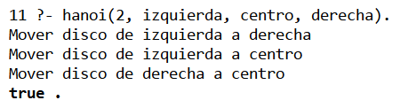
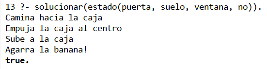

+++
date = '2026-05-01T16:55:43-07:00'
draft = false
title = 'Practica4: El paradigma logico'
+++

**Materia:** 40032 - Paradigmas de la Programación  
**Docente:** M.I. José Carlos Gallegos Mariscal  
**Grupo:** 941 

---

## 1. Introducción

### 1.1 Objetivo

El objetivo de esta práctica fue introducir el **paradigma lógico de programación** mediante el uso del lenguaje **Prolog**, utilizando el entorno **SWI-Prolog**.

Se implementaron dos problemas clásicos de inteligencia artificial:

- Las Torres de Hanoi
- El problema del Mono y la Banana

A diferencia de otros paradigmas, en Prolog no se describe paso a paso cómo resolver un problema, sino que se definen hechos y reglas, y el sistema de inferencia encuentra la solución mediante unificación y backtracking.

---

### 1.2 Herramientas utilizadas

| Herramienta | Función |
| - | - |
| SWI-Prolog | Intérprete del lenguaje Prolog |
| Visual Studio Code | Editor de código |
| GitHub | Repositorio del proyecto |

---

### 1.3 Conceptos del paradigma lógico

| Concepto | Descripción |
| - | - |
| Hechos | Afirmaciones verdaderas |
| Reglas | Relaciones lógicas entre hechos |
| Consultas | Preguntas al sistema |
| Unificación | Emparejamiento de patrones |
| Backtracking | Búsqueda automática de soluciones |

---

## 2. Desarrollo de la práctica

### 2.1 Estructura del proyecto

```text
practica-prolog/
├── hanoi.pl
├── mono.pl
├── index.md
```

### 2.2 Torres de Hanoi
#### Descripción
El problema consiste en mover una serie de discos de un poste a otro utilizando un poste auxiliar, sin colocar un disco grande sobre uno más pequeño.

#### Codigo Fuente

```prolog
% Caso base
hanoi(1, Origen, Destino, _) :-
    write('Mover disco de '), write(Origen),
    write(' a '), writeln(Destino).

% Caso recursivo
hanoi(N, Origen, Destino, Aux) :-
    N > 1,
    N1 is N - 1,
    hanoi(N1, Origen, Aux, Destino),
    write('Mover dis de '), write(Origen),
    write(' a '), write(Destino),
    hanoi(N1, Aux, Destino, Origen).
```

#### Ejecución
```prolog
?- hanoi(3, izquierda, derecha, centro).
```

#### Resultado
El programa genera los movimientos necesarios para resolver el problema de forma recursiva.

---

### 2.3 El Mono y la Banana
#### Descripción
Se modela un problema de búsqueda donde un mono debe alcanzar una banana utilizando una caja.

#### Estado del problema
```prolog
estado(PosMono, Altura, PosCaja, TieneBanana)
```

#### Codigo fuente
```prolog
caminar(estado(_, suelo, Caja, Banana),
        estado(Caja, suelo, Caja, Banana)).

mover_caja(estado(Pos, suelo, Pos, no),
           estado(centro, suelo, centro, no)).

subir(estado(centro, suelo, centro, no),
      estado(centro, encima, centro, no)).

agarrar(estado(centro, encima, centro, no),
        estado(centro, encima, centro, si)).

solucionar(E0) :-
    caminar(E0, E1),
    mover_caja(E1, E2),
    subir(E2, E3),
    agarrar(E3, _).
```

#### Ejecución
```prolog
?- solucionar(estado(puerta, suelo, ventana, no)).
```

---

### 2.4 Observaciones
* Prolog resuelve problemas mediante reglas, no instrucciones paso a paso.
* El orden de las reglas es importante.
* Si una condición no coincide, el sistema intenta otra solución automáticamente.

### 3. Conclusión
Esta práctica permitió comprender cómo el paradigma lógico utiliza reglas y hechos para resolver problemas.
Se observó que Prolog es especialmente útil para problemas de inteligencia artificial y búsqueda en espacios de estado, ya que el sistema realiza la inferencia automáticamente.

### 4. Evidencias
#### Torre de Hanoi


#### El Mono y la Banana


#### Enlaces
[GitHub](https://github.com/menaxmn/PortafolioPP "Repositorio GitHub")

[GitHub Pages](https://menaxmn.github.io/PortafolioPP/ "Sitio Estatico") 